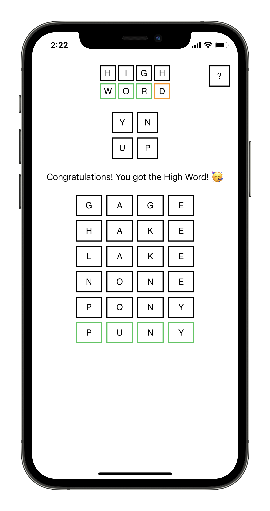
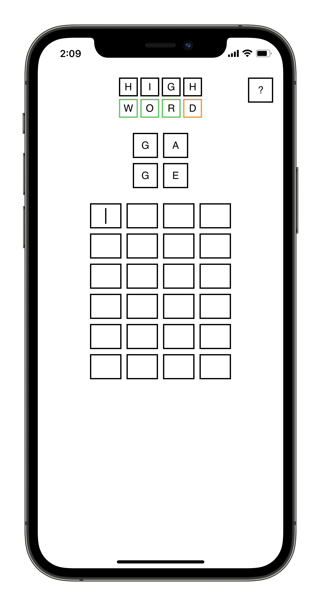
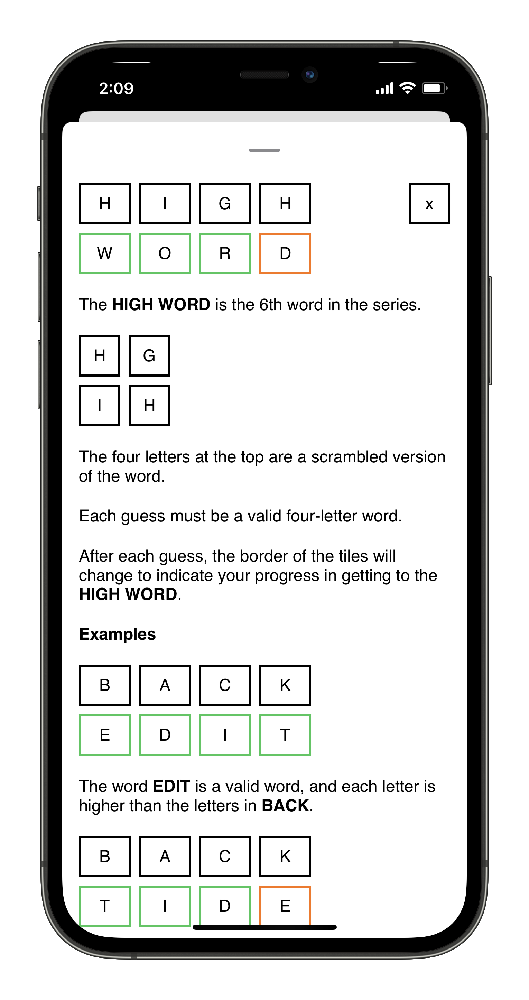
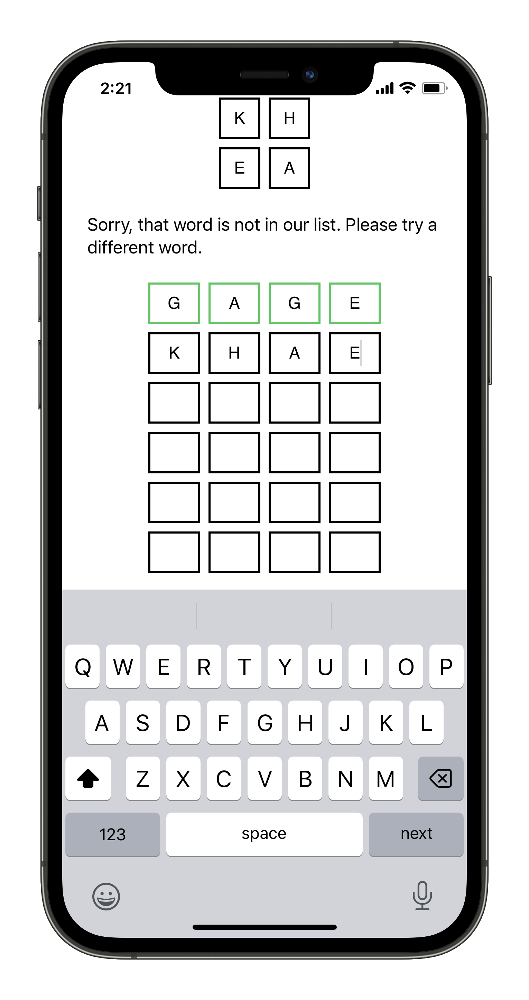
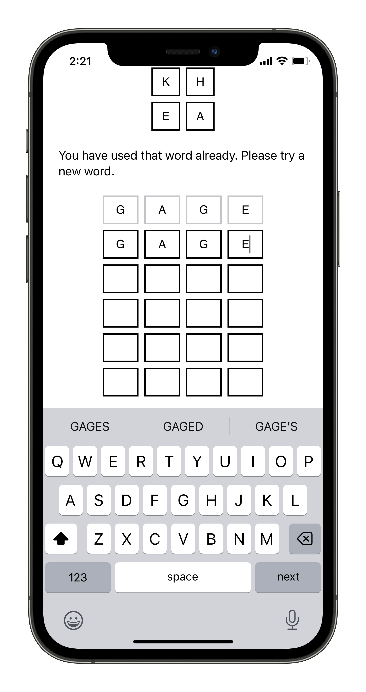
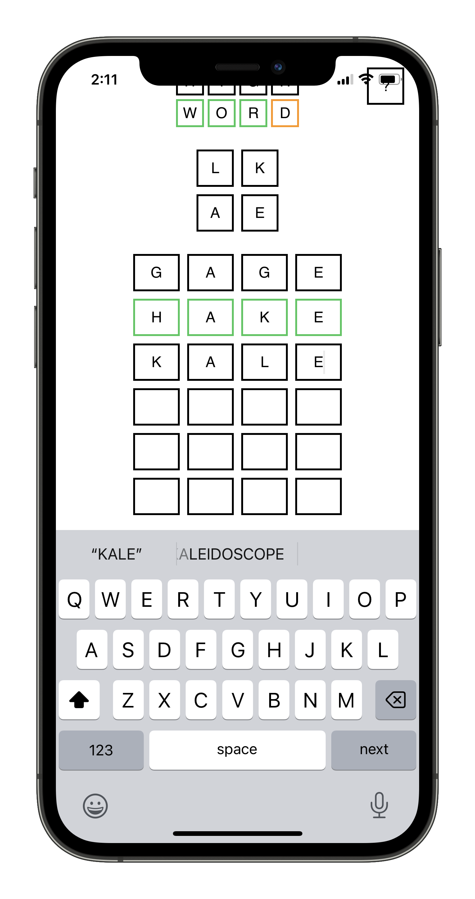
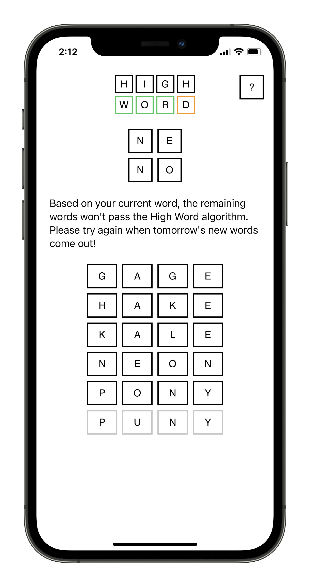

# High-Word
## Overview
High Word is a spin-off of the viral word game Wordle.

In High Word, you unscramble a given four-letter word to find the correct word. There are a total of 6 words and they need to be in alphabetical order, vertically. The 6th word in the series is called the HIGH WORD. The goal is to successfully get all 6 words to meet the criteria to complete the HIGH WORD for the day. Each day, there is a new set of words for the player to work with. 

## Detailed Walkthrough
For example, if the first word is BACK, each letter the next word has to be equal to or greater than the same index in the above word. EDIT would be a valid word to follow because each letter in any given index is the same or greater than those in BACK. TIDE, on the other hand, would not be able to follow BACK because in the last index, E is less than K.

 

As user enter the words, the game checks to see if it is a valid word in the English language, if the user has already used the word, and if the word meets the HIGH WORD criteria, as mentioned above. If the user does not enter a valid word or if the user has already used the word, an unobtrusive error message will appear at the top of the game to let the user know what went wrong.

  

If the user's word meets the HIGH WORD criteria, it is highlighted green and the user can move onto the next word. If the user enters a word that is valid and meets the HIGH WORD critera but the following word in the set would not be able to meet the HIGH WORD criteria, then the game is over. The rest of the words are filled with the correct responses and the user has to wait until the next day to play another game.

 
